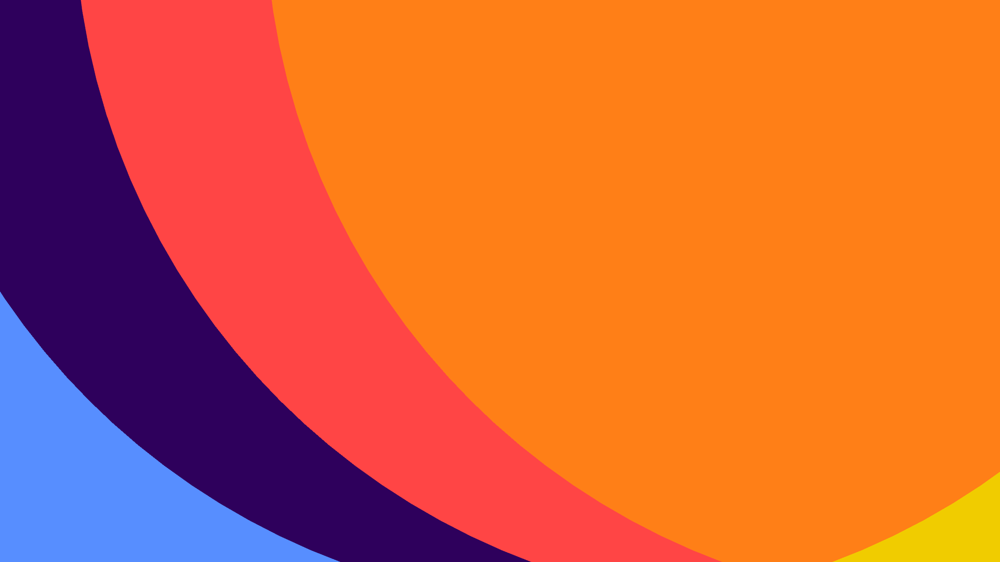

# Shapes

## Overview

A series of four scenes that create a looping animation. These scenes mostly utilize an orthographic camera and simple objects, coupled with multi-pass unlit stencil shaders.

You can [view the animation on Vimeo](https://vimeo.com/920316540?share=copy) or [download the final builds](https://github.com/richardfxr/unity-explorations/releases/tag/Shapes).

## Easing Functions

These scenes are *not* animated using [Unity’s animation curves](https://docs.unity3d.com/Manual/animeditor-AnimationCurves.html) as one would reasonably expect. Instead, I implemented a series of easing functions in [Easing.cs](https://github.com/richardfxr/unity-explorations/blob/02-Shapes/Assets/Scripts/Easing.cs), they are:

- `EaseOutExp()`: [exponential ease-out function](https://www.desmos.com/calculator/0hcegz0op6)
- `EaseInExp()`: [exponential ease-in function](https://www.desmos.com/calculator/y8sgqrczdr)
- `EaseInOutExp()`: [exponential ease-in and -out function](https://www.desmos.com/calculator/aabaxnked2)
- `Circle()`: [function that graphs a circle](https://www.desmos.com/calculator/bsdqn03cst)
- `CubicBezier()`: failed [Cubic Bézier](https://en.wikipedia.org/wiki/B%C3%A9zier_curve) implementation

These functions take in the following parameters:
- `duration`: the total time of the easing
- `time`: the current elapsed time
- `start`: starting value of the easing curve
- `end`: ending value of the easing curve
- `exponent`: the exponent

## Unlit Stencil Shaders

The weird shaders that change color when geometries overlap are achieved using the [stencil buffer](https://docs.unity3d.com/Manual/SL-Stencil.html). The number of passes defines how many layers of overlapped geometry the shader can color:

- [`UnlitStencilOnePass.shader`](https://github.com/richardfxr/unity-explorations/blob/02-Shapes/Assets/Materials/UnlitStencilOnePass.shader): 1-pass stencil shader
- [`UnlitStencilTwoPass.shader`](https://github.com/richardfxr/unity-explorations/blob/02-Shapes/Assets/Materials/UnlitStencilTwoPass.shader): 2-pass stencil shader
- [`UnlitStencilThreePass.shader`](https://github.com/richardfxr/unity-explorations/blob/02-Shapes/Assets/Materials/UnlitStencilThreePass.shader): 3-pass stencil shader
- [`UnlitStencilFourPass.shader`](https://github.com/richardfxr/unity-explorations/blob/02-Shapes/Assets/Materials/UnlitStencilFourPass.shader): 4-pass stencil shader
- [`UnlitStencilFivePass.shader`](https://github.com/richardfxr/unity-explorations/blob/02-Shapes/Assets/Materials/UnlitStencilFivePass.shader): 5-pass stencil shader

## Animations

Each scene is animated using a single [coroutine](https://docs.unity3d.com/ScriptReference/Coroutine.html) with one or multiple `while` loops. A collection of [constants](https://learn.microsoft.com/en-us/dotnet/csharp/programming-guide/classes-and-structs/constants) that define the animation is declared at the beginning of each animation script, allowing for easier customization.

- [`Scenen0Animation.cs`](https://github.com/richardfxr/unity-explorations/blob/02-Shapes/Assets/Scripts/Scenen0Animation.cs): scene 0 animation script
- [`Scenen1Animation.cs`](https://github.com/richardfxr/unity-explorations/blob/02-Shapes/Assets/Scripts/Scene1Animation.cs): scene 1 animation script
- [`Scenen2Animation.cs`](https://github.com/richardfxr/unity-explorations/blob/02-Shapes/Assets/Scripts/Scene2Animation.cs): scene 2 animation script
- [`Scenen3Animation.cs`](https://github.com/richardfxr/unity-explorations/blob/02-Shapes/Assets/Scripts/Scene3Animation.cs): scene 3 animation script

## Download

Download the code and import that directory into [Unity Hub](https://unity.com/unity-hub). Open the project using [Unity 2022.3.10](https://unity.com/releases/editor/whats-new/2022.3.10).

The final builds of this project can be found in the [Shapes v1.0.0 release](https://github.com/richardfxr/unity-explorations/releases/tag/Shapes).

## References

- [Easing Functions Cheat Sheet](https://easings.net/)
- [Cubic Bézier: from math to motion](https://blog.maximeheckel.com/posts/cubic-bezier-from-math-to-motion/)
- [Pidhorskyi’s Stack Overflow answer about two-pass stencil shaders](https://stackoverflow.com/a/36532246)
- [Coroutines in Unity (how & when to use them)](https://youtu.be/kUP6OK36nrM?si=YL4RzwnuXnEWWE1X)